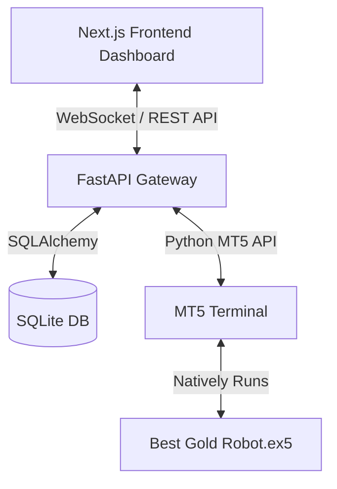
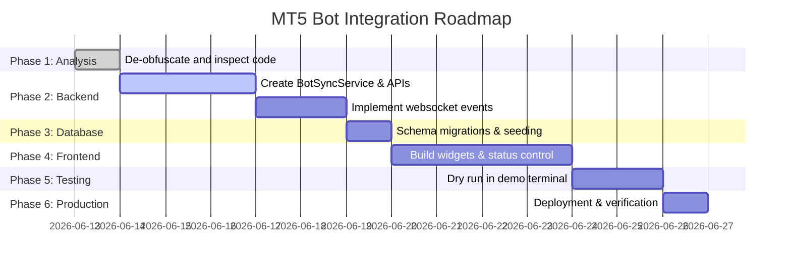

# MT5 Bot Integration Plan

This document outlines the architecture, data flow, and roadmap to integrate the **Best Gold Robot** (MT5 Expert Advisor) into the existing **MT5 Algo Trading Platform**.

## 1. High-Level Integration Architecture

Since the EA (`Best Gold Robot.ex5`) is a third-party compiled binary, it runs natively in the MetaTrader 5 Terminal. Our platform will interface with it using two complementary integration patterns:

1. **Passive Monitoring (Python MT5 API)**: The Python backend (`mt5_service.py`) polls the MT5 terminal for open positions, trade history, and account metrics. It identifies trades opened by the bot using its MagicNumbers (default `1001` to `1008`) and broadcasts these metrics in real-time.
2. **Active Control (Virtual Dashboard Engine)**: The dashboard allows the user to:
   - Toggle the bot's operation (by placing/deleting the bot's pending stop orders).
   - Apply real-time safety limits (daily loss limits, equity trailing drawdown protection).
   - View strategy-by-strategy (Strategy A-H) metrics.

---

## 2. Integration Components

### A. Backend Integration
- **Monitoring Service (`bot_sync_service`)**: A Python background task that polls MT5 terminal state, filters positions with MagicNumbers `1001-1008`, maps them to Strategy A-H, and updates the database.
- **API Endpoints**: REST API endpoints for starting/stopping the bot (via deleting pending orders), modifying risk thresholds, and retrieving strategy performance metrics.
- **Scheduler Requirements**:
  - A 1-second interval task for WebSocket telemetry broadcasts.
  - A daily reset cron job at broker midnight (00:00) to clear daily profit watermarks.
- **Signal Engine**: Monitors resistance/support break levels derived from the de-obfuscated swing high/low calculations to display prospective entry points on the frontend dashboard before the bot enters.

### B. Frontend Integration
- **Dashboard Widgets**:
  - Real-time Balance, Equity, and Drawdown cards.
  - Net Profit vs. Target tracker with gauge bar.
  - Active Strategy distribution wheel (Strategy A-H active status).
- **Strategy Monitoring Page**: Detailed breakdown of Strategy A-H (Magic 1001-1008) including individual win rates, lot sizing, and cumulative profit.
- **Bot Status Page**: Controls for starting, pausing, or stopping the bot (deleting pending stop orders) and selecting preset configurations.
- **Trade History Page**: Tabular layout of completed trades with filters for Strategy, Symbol, and date ranges.
- **Risk Management Page**: Input forms for Daily Profit Target, Daily Loss Limit, Max Drawdown Threshold, and toggles for Auto-Close and Auto-Disable.

### C. WebSocket Events
- `terminal_sync`: Real-time account stats (balance, equity, margin).
- `bot_status_update`: Current state of the robot (running, stopped, paused).
- `strategy_metrics`: Updates on Strategy A-H individual metrics.
- `risk_alert`: Triggers if daily loss limit or drawdown threshold is breached.

---

## 3. Implementation Roadmap

- **Phase 1: Analysis**: Completed. Reverse engineered the swing high/low and Strategy A-H parameters.
- **Phase 2: Backend Integration**: Implement the `bot_sync_service.py` to identify bot trades and build API routes.
- **Phase 3: Database Integration**: Add strategy performance and trade mapping tables.
- **Phase 4: Frontend Integration**: Develop strategy monitoring, bot control, and risk pages.
- **Phase 5: Testing**: Validate system with MT5 in a demo account environment, simulating target reaches and loss limit breaches.
- **Phase 6: Production Deployment**: Go live with MT5 terminal connected to a live funded account.
